# The Film Review - A Django Project

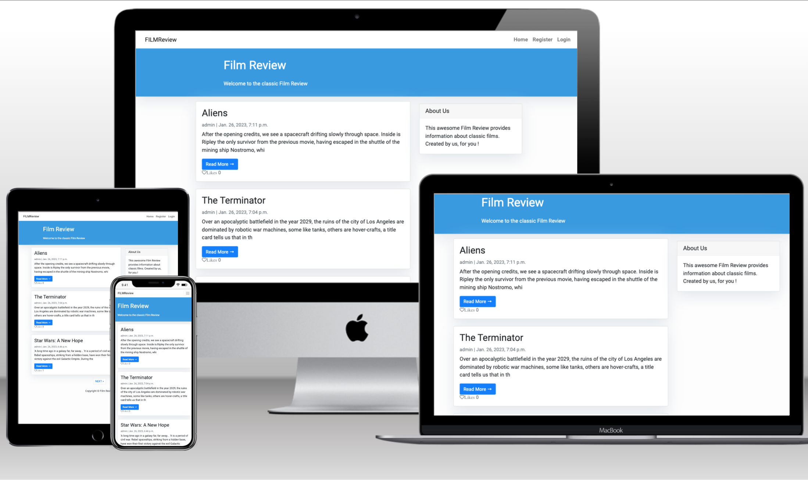

This is my fourth milestone project.
Here is the link for [The Film Review](https://project-4-film-review.herokuapp.com/)

#  Who Is This Website For?
This webiste has been created for people who like the classic films, the golden oldies. Where they can read the synopsis of a classic film. Users can create an account, leave a comment and join in the conversation. Users also have the opportunity to like specific posts about their absolute favourite films within the Review. 

# UX - User Experience 

The project was planned in 5 stages. 

- Strategy Plane 

- Scope Plane 

- Structure Plane

- Skeleton Plane

- Surface Plane 

## The Strategy Plane 

## User Persona

This webiste is targeted at those people who love a blockbuster film, that everyone has seen, but only true film enthusiasts, love. 

## User Goals 
### Unregistered
- Be able to navigate the site easily 
- View the posts on the website 
- Send a message to the site admin

### Registered (the above and plus+)
- Be able to register quickly and easily 
- Like posts
- Create own comment on the post

### Site Owner Goals
- Create, View, Update and Delete posts
- Approve or Disapprove comments from users
- Delete comments/ratings on the site
- Blank forms are not sent ("contact us" form)
- Have a site that is easy and smooth to navigate and learn so that viewers will return in the future to view and engage in more content. 

## User Requirements and Expectations 
### Requirement
- Easy to navigate 
- Content on posts is relevant and interesting to users
- Easy to locate useful tools such as signin or logout

### Expectations 
- Expect the navigation links work and direct users where they intend to go
- Expect to be able to successfully leave a comment (when logged) for authorisation from the admin.
- Expect feedback when user registers, logs in, logs out

## User Stories
These stories have been assigned Low, Medium, or High next to the story to clarify which order the stories are to be prioritized in. 

### Unregistered Users
-   As a user I want the site to be easy to navigate
-   As a user I want to be able to open and view posts
-   As a user I want to view other site users comments
-   As a user I want to be able to register an account with ease
-   As a user I want to be able to send comments, and messages to the site admin

### Registered User (the above and plus+)

-   As a user I want to be able to like posts
-   As a user I want to be able to leave comments
-   As a user I want the site to be relevant and only contain information in a clean way

## Site Admin 

-   Owner should be able to log into admin account
-   Owner should be able to create, display, update and delete post
-   Owner Should be able to approve or delete any comment, regardless of comment age

## Agile Methodology 
- This application was developed using Agile Methodology. The palnning, design and implementation of the application was created using a project board, where the user stories, or key functions that this application needs are based. The project board contains 3 sections that show various stories that need to be started, in progress or completed. 
Here is a link to my [ProjectBoard](https://github.com/users/ddrobrien/projects/3/)

### User stories against user goals to be achieve. 

As a site user;

**Story**: As a user I want to be able to open a post

**Goal**: Be able to to fully read a post if I wish

*Priority*: Medium 

**Story**: As a user I want to view a list of posts

**Goal**: View the posts on the website

*Priority*: High

**Story**: As a user I want to be able register for an account

**Goal**: If I like what I see, I want to be able to register for an account to be able to like and leave comments

*Priority*: High

**Story**: As a user I want view comments, and join in the conversation

**Goal**: I want to see other people's opinions on the films I love.  

*Priority*: Medium

**Story**: As a user I want to be able to comment on a post

**Goal**: I want to be able to leave a comment so I can join in the conversation

*Priority*: Medium

**Story**: As a user I want to be able to like posts

**Goal**: Like posts

*Priority*: Low

As a Site Admin;

**Story**: Owner should be able to log into account

**Goal**: Have a site that is easy and smooth to navigate and learn so that viewers will return in the future to view and engage in more content.

*Priority*: High

**Story**: Owner should be able to create, display, update and delete post

**Goal**: Create, View, Update and Delete posts

*Priority*: High

**Story**: Owner Should be able to approve or delete all comments, regardless of comment age. 

**Goal**: 1. Approve or Disapprove comments from users

          2. Delete comments on the site

*Priority*: High

# The Scope Plane

The features of this project:

5 pages /
- Home, Register, Login, Logout
- Pagination 
- Film posts 
- Comments from other site visitors displayed 
- Comments form for registered user to submit 
- Crud functionality (Create, Read, Update and Delete) - Applied to the comments model
- Success messages (Successfully register, login, logout or post comment)

# The Structure Plane 

## Design Thinking 
I have tried to keep the site features the same, so that whichever page you are on, it looks the same as the page you just visited.

### Blog Features 

- Title header - Displays the site name, which is descriptive of the site for users and visitors. 

- Navbar - Responsive and navigates to the Home page, Login or Logout, Register pages. 

- Home page - I have tried to keep the homepage simple, so that users focusonly on the content. Also, no images have been used to avoid any copyright infrindgment.  

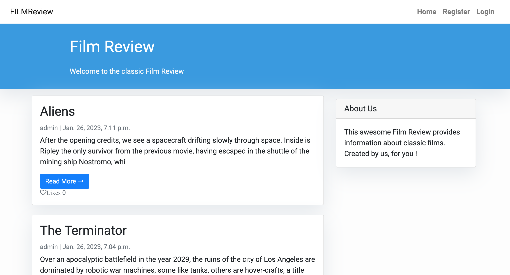

- Register, Login and Logout

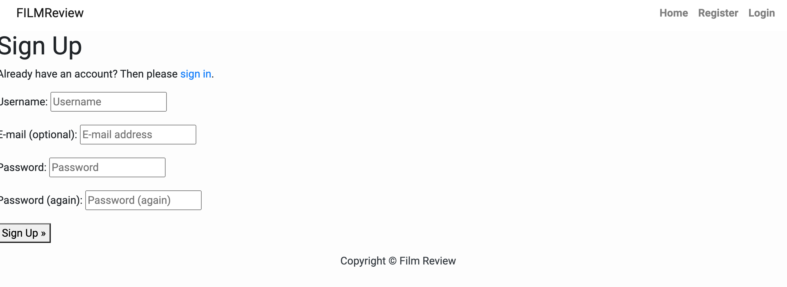
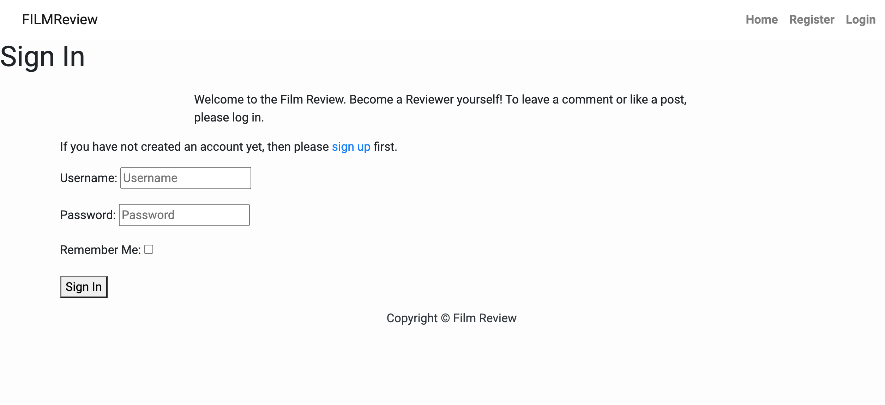
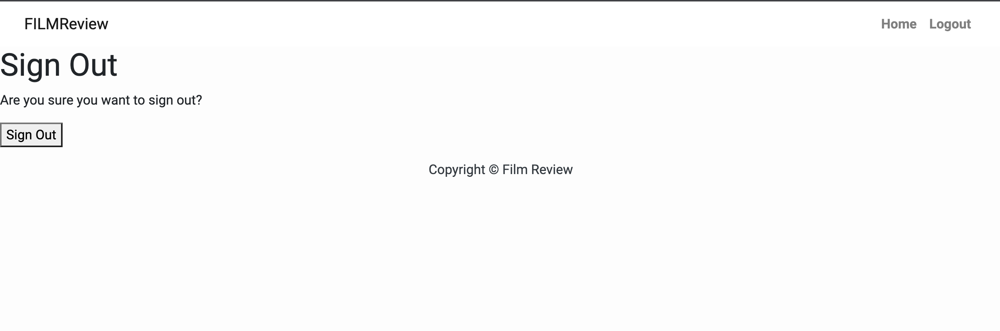

- Site Pagination - Each page displays up to 3 posts 

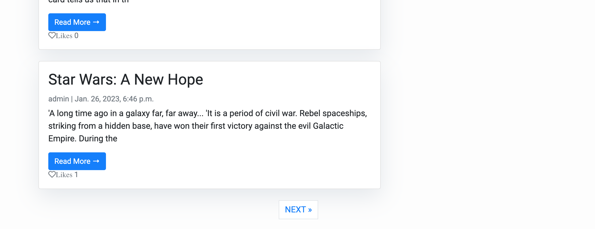
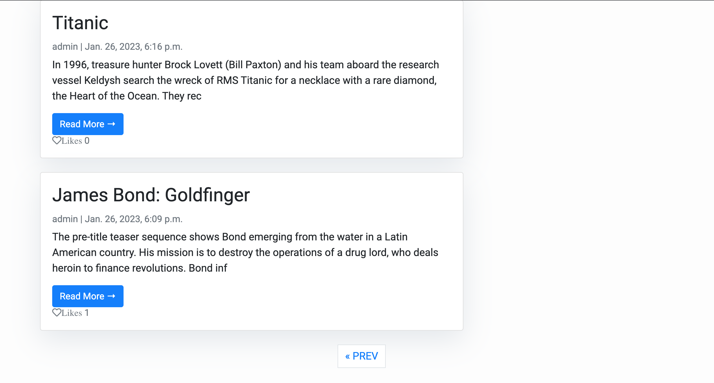

- Comments form - Visible under the full post for registered users to leave a comment

- Comments section for users who are not logged in will not display the form to input. Instead, they are given a link to follow to sign in. 

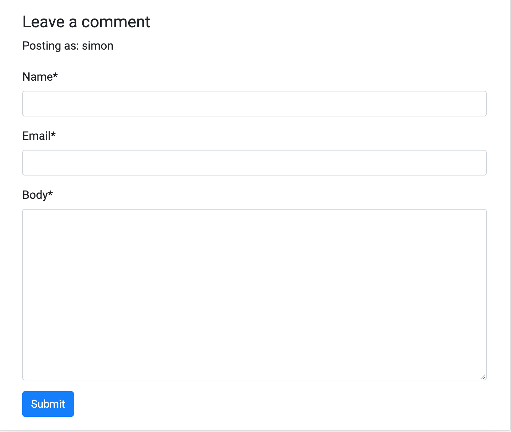

- Posts - The blog posts have an image of the bag, its name, the date the post was created, and an excerpt. The full post contains the actual blog about the bag. 

- Post when opened - A title of the post followed by the film synopsis 

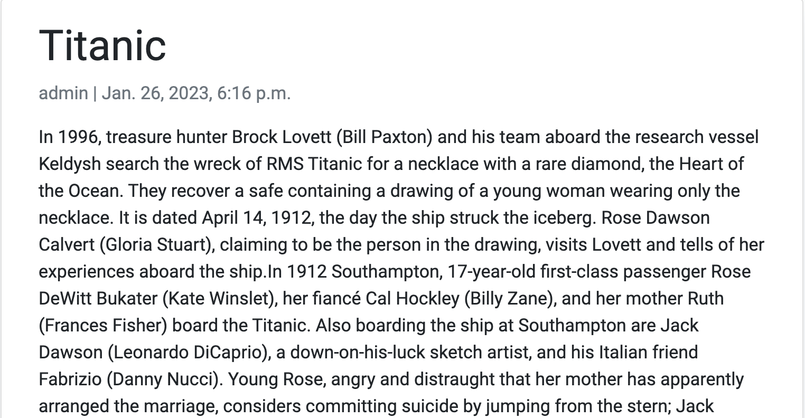

- Likes - A heart for users to click to like a post 

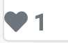

# The Skeleton Plane 

The design of this project was to make a simple application, that is easy to navigate and understand. 

The planning of this project I decided to write lists on what I wanted to achieve in the project and final application. The list is:

- have film posts
- make them classic/blockbuster films
- users can read brief intro posts
- the user cnd decide to read a full post if they wish
- the user can leave register, log in and log out
- I wanted the Film Review to have a sign/symbol displayed on every page

- I wanted an "About Us" box describing the reason behind the review on the mainpage and full post view page.

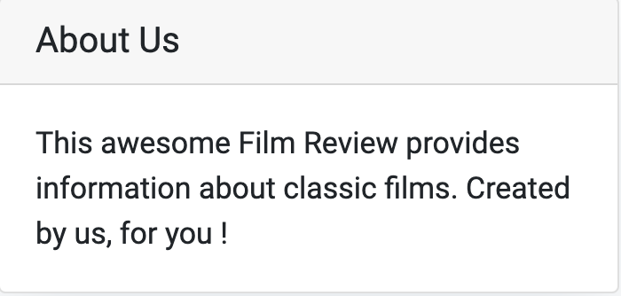

- I wanted users to be able to comment on posts
- I wanted users to be able to like posts
- I wanted to create an admin area
- In the admin area I wanted the admin to be able to create posts, review posts and comments, update posts and delete posts and comments if they wish. 

# Surface Plane 
## Design Tools / Colour Palette

I kept the colour choice simple for the Film Review. I used Cooler to keep things simple. 

# Testing 
- CSS test  - pass

- HTML test - pass

- Python check- pass

## Bugs 
There were various bugs I encountered in the writing of this application.

- After creating the the admin area, there was an issue publishing posts and approving comments. THey bought up page failures. Lookng at the views page, and reading the errors on the page break down. The page failed due to the 'approved' input within the string. After changing these to Active and updating the urls.py form, it then worked. 

- Leaving a comment, wouldn't go through to the admin page to be approved. After spending a lot of time speaking to my mentor, and Code Institute Tutor support, the Tutor told me to follow the I love To Blog walkthrough project and copy that code. Once I did that, the comments section worked perfectly. 

- There was an issue with viewing the full post. when users clicked the "read more" button, the post wouldn't load. After consulting Slack, other students helped identify the problem. That now works well. 

- There is still an issue with the Likes button. Which I would fix if I had more time, but due to the deadline, I cannot. 

## Manual Testing 
- Test all links in Navbar work 

- Test site pagination works  

- Test a Post Model: 
Posts can be created, displayed, updated, and deleted 
Check the full post can be read by clicking Read More button

- Test Comments Model: 
User needs to be logged in to leave a comment
Comments can be created by the user
The comment displays 
Comments once submitted need to be approved 

# Technologies used 
### Languages
- HTML5
- Python 
- HTML
- CSS

### Frameworks
- Django
- Bootstrap

### Databases
- PostgreSQL

### Django Extensions
- All AUTH
- Summernote 
- Django Crispy Forms 

### Cloud Storage and Deployment Services 
- Heroku
- Gunicorn

# Future implementation 
- Single sign on using allauth:
Allowing users to sign in with social media accounts, and link their social media handles to their user site and comments section. 

- Design:
I would like the design to be more modern, and incoorporate some additional user functionality, like suggestions for future posts. 

- Search options
I would like registered users to be able to search for their favourite films, especially as more posts are added.  

# Deployment 

## Initial Deployment:

Install django and packages with these commands:

- `pip3 install 'django<4' gunicorn`
- `pip install dj_database_url psycopg2`
- `pip3 install dj3-cloudinary-storage pip3 freeze --local > requirements.txt`
- `django-admin startproject "project_name".`
- `python3 manage.py startapp "app_name"`
- `pip3 install django-crispy-forms`
- Migrate the work using:
- `python3 manage.py makemigrations --dry-run`
- `python3 manage.py makemigrations`
- `python3 manage.py migrate`

Enter command: python3 manage.py runserver to see the preview.
It should say that django installed successfully.

## Env.py file.
- Add postgres `DATABASE_URL` and `SECRET_KEY`.
- Ensure `env.py` is in the `gitignore-file`

## Commit all changes to GitHub.
- `git add .`
- `git commit -m "commit message."`
- `git push`

## Set up deployment with Heroku:
- Register and login to `Heroku`.
- Create an app with a unique name and choose the region that is closest to you, USA or Europe.
- In Heroku/app/resources add postgres and attach it to the database url.
- Under Settings-> Config vars:
- Cloudinary is used to store images, therefore a Cloudniary API variable was added to config vars.
- `DISABLE_COLLECTSTATIC:` This is to prevent accidentally showing debug messages while `DEBUG is True` in `settings.py`
- Add `port 8000`
- Add `SECRET_KEY` from the `env.py` file.

- Under Deploy, choose deployment methods `Github` and search for my repository.
- The branch to deploy should be set to `main`.
- Deploy branch

## Issues with deployment so I followed below commands, deployment then worked.
- Login to Heroku in terminal
- `heroku login -i`
- Provide Heroku username, email and password.
- `heroku run python3 manage.py migrate --app APP_NAME`

## PostgrSQL as the database for deployment
- Add the following to the `Settings.py` file: `DATABASES = {'default': dj_database_url.parse(os.environ.get('DATABASE_URL'))}`

- Set `DEBUG = 'DEVELOPMENT' in os.environ`

- In `env.py` add os.environ['DEVELOPMENT'] = 'True'

- Migrate those changes and push them to `github`.

- Remove `DISABLE_COLLECTSTATIC` in heroku config vars.

# Resources
- Code Institute- Course material & Tutor support
- Code Institute- Slack community 
- W3C- Validate HTML code
- W3C- CSS Validation 
- Peps- Python Validation 
- W3Schools - gave me ideas about About me bar and navigation
- Django Central- to create a customize html templates and ideas about views and forms. 

# Credits 
- Django "I think, therefore I blog"  Code Institute Documentation

- Django Central- Building a Blog https://djangocentral.com/building-a-blog-application-with-django/

- Django Central- Comments https://djangocentral.com/creating-comments-system-with-django/ 

- Deployment to Heroku- Django "I think therfore I blog" Code Institute

## Special mentions 

Tutor support at Code institute, they were simply brilliant. Didn't stop until this issue was resolved, and did their best to help me understand where I had gone wrong. A special mention to tutor Rebecca, a true life saver. 

Slack community for stopping me from throwing in the towel. I personally found this project difficult, and had many failed attempts. After speaking to the Slack community, they helped me make sense, and also apply for an extension. Without those members, I would hate to think where i would be. 

My mentor Spencer Barriball who assisted as much as he could at every stage. Allowed to vent at him, and also helped by breaking down a large project into tiny tasks. He ensure I planned what I was going to do, and in my opinion, he went above and beyond with me, all while sticking to the rules of course.  